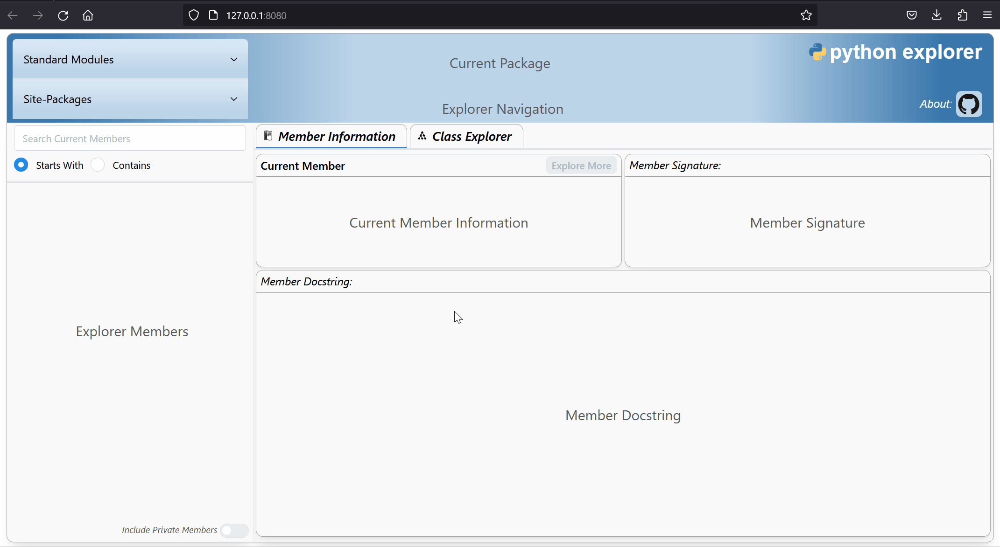
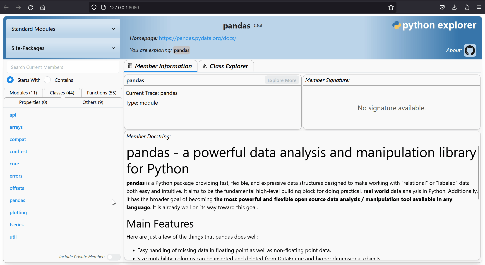
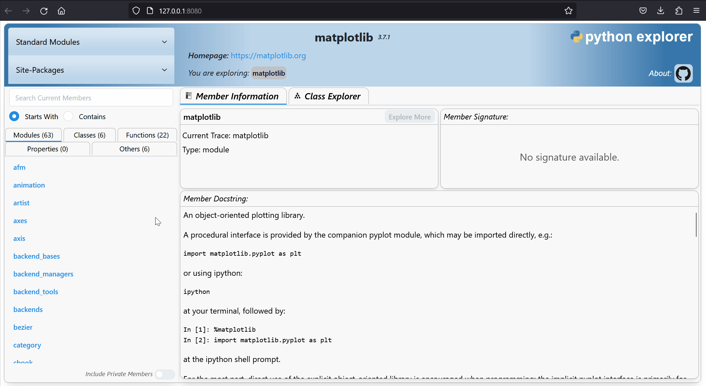
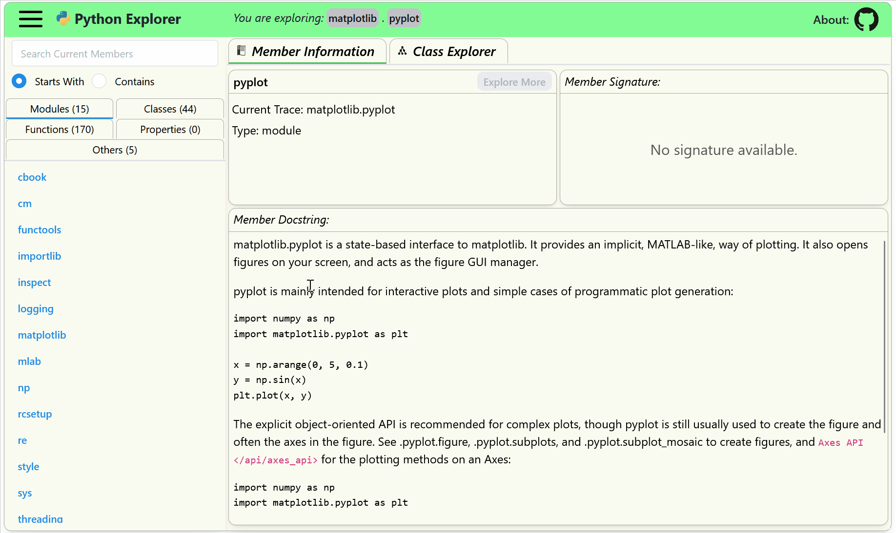

<h1 style="text-align: center">Python Explorer</h1>

[](https://badge.fury.io/py/python-explorer)

<p style="text-align: center; font-style: italic">A Python environment exploration interface.</p>

Written 100% in Python and renders in your browser using [Dash](https://dash.plotly.com).

An online demo version can be accessed here: [python-explorer demo](https://python-explorer.onrender.com/).

Motivation
---------- 
After I was introduced to Python by a colleague, I found myself constantly asking how he knew the name of a given ```object``` and how do I know what other items or methods are available for use? The obvious resource for answering these questions is to read the docs. However, even the best examples of documentation can be cumbersome to navigate and, oftentimes, still left me confused as to how items were related or where they came from. Additionally, the only reason we are generally aware about a certain class/function/method is because we had a direct need for it and googled a similar example. While very helpful in the moment, this can result in a lack of awareness for other potentially useful portions of the code or package.

Thus, this tool is intended to live somewhere in the middle of full documentation resources and examining the raw code. Like the name implies, this is an exploration. The information provided is only as good as the documentation in the code, so some items may not have any information and some packages may be super confusing without more context. This is when the user is directed to explore the source documentation for further insight. Note that some IDE's provide similar access to the information provided in terms of available methods and docstrings. However, I felt that I generally still needed to already know what I was looking for and the exploration aspect was also lost. My hope is to quickly answer questions like what are the basic pieces of a given package? What are all the methods or items available for a given object? How do these pieces fit together? 

Having a tool that allows the user to quickly scan through a listing of available items generally encourages further curiosity, understanding, and discovery.... this is my current goal.

Install
-------
Install with pip into your current environment.

```cmd
> pip install python-explorer
```

About The Tool
--------------
### Getting Started

To open and run the interface from the command line interface, type ```python-explorer```. This will launch the interface in your default browser. To terminate the session, press Ctrl+C while in the command prompt.

```cmd
> python-explorer
Exploring: Python Explorer started on 'http://127.0.0.1:8080/
Exploring: Number of threads: 8
Exploring: Press Ctrl+C to terminate
```
Access help features and other options with the --help option.

```cmd
> python-explorer --help
Usage: python-explorer [OPTIONS]

  Launch Python Explorer in browser.

Options:
  -h, --host TEXT        The interface to bind to.  [default: 127.0.0.1]
  -p, --port TEXT        The port to bind to.  [default: 8080]
  -t, --threads INTEGER  Number of waitress threads.  [default: 8]
  --help                 Show this message and exit.
```

The cli command will launch python-explorer in your default browser. The package listing in the top left dropdowns are derived from the environment in which python-explorer was installed. Click on any of the package listings to access its members and start exploring the information. If a package is not accessible for some reason, a notification alert will display in the upper right portion of the window.



### Explore More
The green **Explore More** button (center top of Member Information tab) allows you to step into certain objects such as modules or classes. You can keep going further into a particular space until it recognizes that there is nothing further to explore.



### Navigation
As you explore objects, the tool will keep track of where you are in the navigation listing (top of page). Just click one of the previous object buttons to return to that state or to view the member information (if any) of the current explored space (right-most button).



### Search Members
For a given space, the search input allows you to filter the members by members that either start with or contain the input text. This helps to narrow down options or helps you find something quicker if you know the name already. Additionally, a toggle located near the bottom left of the page allows to include private members in the listings. Traditionally, these are object names that start with a single underscore ( ```_foo``` ).



### Class Explorer
The Class Explorer tab opens up a cytoscape graph of the current classes for a given space and their associated relationships. The graph includes the super classes of the given list and so may include classes that are outside the current explored namespace. The layout dropdown menu lets you choose different layout options or you can drag and organize the results as you please.

Both the Member Information tab and the Class Explorer tab are active in the background so feel free to switch back and forth between them. NOTE: the search feature and private member toggle do not currently affect the cytoscape output.


Future
------
This has been quite the journey and a great learning experience, but there is still so much that I do not know and a lot of aspects that could be done better. I am eager to see if others find this tool useful and what ideas you might have to improve or add to the tool.

I am definitely open to suggestions for improvements, ideas, collaboration interest, etc.

#### Current Ideas:
* Open to suggestions on the cytoscape formatting. I didn't think too hard about it, but would like to have better color contrast and clarity as to what is being represented.
* I quickly found that absolutely nothing is consistent when it comes to docstrings, so if someone has a more robust (and safe) way of displaying a variety of docstring inputs, I'm all ears. 
* Formatting of the signature output could be improved.
* One of the more challenging aspects I ran into was determining the import name for a given package. If it wasn't available in the toplevel.txt or entry_points and wasn't a direct derivative of the package name, there isn't really any logic that can determine the random import name that the author chose. Is there a standard way of doing this? This is why some packages will fail to import; the tool doesn't know what import name to use.
